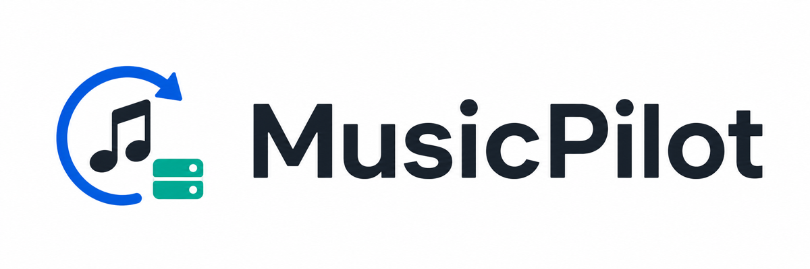
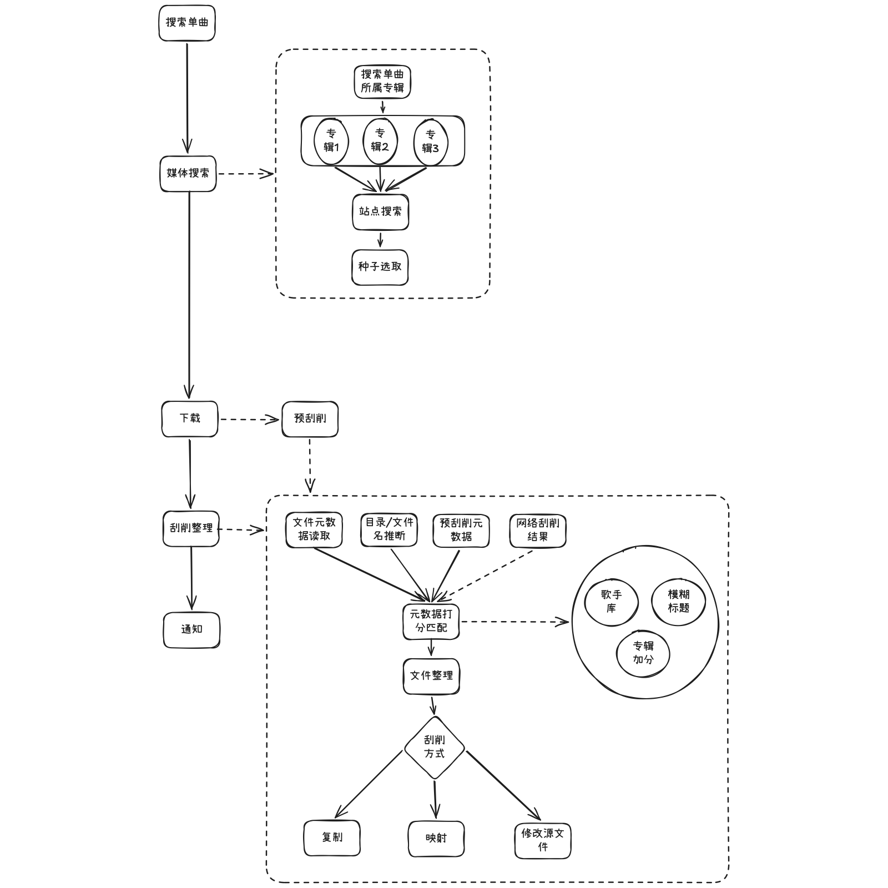

# MusicPilot

<p align="center">
  
</p>

Language: [简体中文](README.md) | [English](README_EN.md)

## 1. Project Overview

MusicPilot is a self-hosted music library automation tool that turns music discovery, resource search, download submission, file organization, metadata completion, library refresh, and playlist sync into one manageable workflow.

It is designed for users who already run services such as PT sites, qBittorrent, and Navidrome. MusicPilot does not replace those systems. Instead, it connects them and reduces repeated manual work around searching, downloading, organizing files, and refreshing the music library.

Core goals:

1. Provide one Web UI for managing music search, downloads, organization, playlists, and music library status.
2. Use a task queue to handle long-running operations, so downloads, scraping, organization, and sync can move forward automatically where possible.
3. Keep deployment simple, use SQLite by default, and support Docker Compose on NAS devices or servers.
4. Keep clear adapter boundaries so more sites, downloaders, music platforms, metadata sources, and media servers can be added later.

## 2. Features

MusicPilot currently provides the following capabilities:

1. Music search and site search
   - Search music metadata first, then search candidate resources on configured sites based on that metadata.
   - Support site concurrency control, excluded keywords, and result deduplication.
   - Use artist, title, album, and related metadata to help filter candidate results.

2. Download task management
   - Submit selected resources to qBittorrent.
   - Track download status, view download details, and delete download tasks.
   - Trigger downstream organization and music library refresh flows after downloads complete.

3. File organization and metadata handling
   - Support source-directory, mapped-directory, and copy-based organization modes.
   - Support automatic scraping, manual organization, lyrics, and tag writing.
   - Record each file's organization status, failure reason, and actual organization type.

4. Playlist management
   - Import external playlists and manage playlist tracks locally.
   - Search, download, and match local library tracks from playlist entries.
   - Sync local playlists to a Navidrome music library, with selectable sync account and public/private status.

5. Music library and artist library
   - Scan and display music library tracks.
   - Maintain artists, aliases, and merge relationships to improve matching across Chinese names, English names, and aliases.
   - Refresh match status between playlists and the music library.

6. System management
   - Configure sites, downloaders, music libraries, notifications, and system parameters.
   - View logs, dashboard statistics, and file management pages.
   - Control basic deployment parameters through Docker environment variables.

## 3. Workflow



## 4. Quick Start

The following workflow is suitable for building and running MusicPilot directly from source on a NAS or server.

1. Clone the project and enter the directory:

```bash
git clone <your-repo-url> MusicPilot
cd MusicPilot
```

2. Copy the environment template:

```bash
cp .env.example .env
```

3. Update the key values in `.env`:

```text
MP_HTTP_PORT=8000
MP_ADMIN_USERNAME=admin
MP_ADMIN_PASSWORD=change-this-password
MP_SESSION_SECRET=change-this-random-secret
MP_HOST_DATA_PATH=/volume1/docker/musicpilot/data
MP_HOST_CONFIG_PATH=/volume1/docker/musicpilot/config
MP_HOST_MUSIC_PATH=/volume1/music
MP_HOST_DOWNLOADS_PATH=/volume1/downloads
```

If the Docker build container cannot reach PyPI while the host network works normally, keep:

```text
MP_DOCKER_BUILD_NETWORK=host
```

If you need a more stable Python package mirror, adjust:

```text
UV_DEFAULT_INDEX=https://pypi.org/simple
```

4. Build and start the service:

```bash
docker compose up -d --build
```

5. Open the Web UI:

```text
http://<NAS_IP>:8000
```

6. View logs:

```bash
docker compose logs -f musicpilot
```

7. Update the project:

```bash
git pull
docker compose up -d --build
```

### 4.1. Configuration Guide

After the first startup, configure sites, downloaders, music libraries, organization rules, and notification channels in the Web UI.

Configuration guide entry: [MusicPilot Configuration Guide](docs/configuration.en.md)

This document will collect the configuration steps. For now, only the entry is provided, and detailed content will be added later.

## 5. Acknowledgements

MusicPilot's design and implementation reference many excellent open-source projects. Special thanks to:

1. [MoviePilot](https://github.com/jxxghp/MoviePilot)
   - MusicPilot is inspired by MoviePilot in self-hosted automation, task orchestration, site and downloader integration, and admin UI experience.

2. [musicdl](https://github.com/CharlesPikachu/musicdl)
   - MusicPilot's multi-source music metadata search and music information completion capabilities reference the practical work in musicdl around music platform data retrieval.

Thanks also to FastAPI, SQLAlchemy, Vue, Vite, Vuetify, qBittorrent, Navidrome, MusicBrainz, NexusPHP, and the broader open-source ecosystem for the foundational capabilities they provide.

This project is still evolving. Issues, discussions, and code contributions are welcome to help make it more stable and easier to use.
